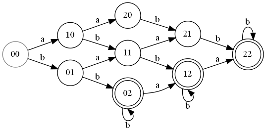

# Задание 1
1.
$$
L = \{\omega \in \{a, b, c\}^*\mid |\omega|_c = 1 \}
$$

2.
$$
L = \{\omega \in \{a, b\}^* \mid |\omega|_a \leq 2,|\omega|_b \geq 2 \}
$$
вершины имеют названия ij, где i - количество встретившихся "a", j - количество встретившихся "b"

3. 
$$
L = \{\omega \in \{a, b\}^* \mid |\omega|_a \neq |\omega|_b\}
$$
т.к. $\overline L = \{\omega \in \{a, b\}^* \mid |\omega|_a = |\omega|_b\}$ не является регулярным, то и $L$ не является регулярным языком, значит не возможно построить автомат,  распознающий данный язык.
Доказательство:
$$
\begin{array}{rcl}
\omega &=& a^nb^n \in \overline L\\
|\omega| &=& 2n \geq n\\
xy &=&a^ia^j, \quad i + j \leq n\\
\omega &=& a^ia^ja^{n - i - j}b^n\\
\omega &=& a^ia^{jk}a^{n - i - j}b^n \notin \overline L \quad ,k > 1
\end{array}
$$
4.
$$
L = \{\omega \in \{a, b\}^* \mid \omega\omega = \omega\omega\omega \}
$$
Если $|\omega| > 0$, то $\omega\omega \neq \omega\omega\omega$ значит язык состоит из пустого слова, $\lambda\lambda = \lambda\lambda\lambda = \lambda$
