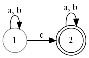

# Задание 1
1. 
    $$
    L = \{\omega \in \{a, b, c\}^*\mid |\omega|_c = 1 \}
    $$
    

2. 
    $$
    L = \{\omega \in \{a, b\}^* \mid |\omega|_a \leq 2,|\omega|_b \geq 2 \}
    $$
    вершины имеют названия ij, где i - количество встретившихся "a", j - количество встретившихся "b"
    

3. 
    $$
    L = \{\omega \in \{a, b\}^* \mid |\omega|_a \neq |\omega|_b\}
    $$
    т.к. $\overline L = \{\omega \in \{a, b\}^* \mid |\omega|_a = |\omega|_b\}$ не является регулярным, то и $L$ не является регулярным языком, значит не возможно построить автомат,  распознающий данный язык.
    Доказательство:
    $$
    \begin{array}{rcl}
    \omega &=& a^nb^n \in \overline L\\
    |\omega| &=& 2n \geq n\\
    xy &=&a^ia^j, \quad i + j \leq n\\
    \omega &=& a^ia^ja^{n - i - j}b^n\\
    \omega &=& a^ia^{jk}a^{n - i - j}b^n \notin \overline L \quad ,k > 1
    \end{array}
    $$

4. 
    $$
    L = \{\omega \in \{a, b\}^* \mid \omega\omega = \omega\omega\omega \}
    $$
    Если $|\omega| > 0$, то $\omega\omega \neq \omega\omega\omega$ значит язык состоит из пустого слова, $\lambda\lambda = \lambda\lambda\lambda = \lambda$
    

# Задание 2
1. 

    $$
    L_1 = \{\omega \in \{a, b\}^* \mid |\omega|_a \geq 2 \and |\omega|_b \geq 2 \} \\
    L_1 = \{\omega \in \{a, b\}^* \mid |\omega|_a \geq 2\} \cap
      \{\omega \in \{a, b\}^* \mid |\omega|_b \geq 2\}
    $$
    
    
    $$
    \begin{array}{rcl}
    \Sigma &=& {a, b} \\
    Q &=& \{AD, AE, AF, BD, BE, BF, CD, CE, CF \} \\
    S &=& AD \\
    T &=& CF
    \end{array}
    $$
    $$
    \begin{array}{lll}
      \delta(AD, a) = BD & \delta(BD, a) = CD & \delta(CD, a) = CD& \\
      \delta(AD, b) = AE & \delta(BD, b) = BE & \delta(CD, b) = CE& \\
      \delta(AE, a) = BE & \delta(BE, a) = CE & \delta(CE, a) = CE& \\
      \delta(AE, b) = AF & \delta(BE, b) = BF & \delta(CE, b) = CF& \\
      \delta(AF, a) = BF & \delta(BF, a) = CF & \delta(CF, a) = CF& \\
      \delta(AF, b) = AF & \delta(BF, b) = BF & \delta(CF, b) = CF& \\
      \end{array}
    $$
    

2. 

    $$
    L_2 = \{\omega \in \{a, b\}^* \mid |\omega| \geq 3 \and |\omega| нечетно \} \\
    L_2 = \{\omega \in \{a, b\}^* \mid |\omega| \geq 3\} \cap
    \{\omega \in \{a, b\}^* \mid |\omega| нечетно\}
    $$
    
    
    $$
    \begin{array}{rcl}
    \Sigma &=& {a, b} \\
    Q &=& \{AE, AF, BE, BF, CE, CF, DE, DF \} \\
    S &=& AE \\
    T &=& DF
    \end{array}
    $$
    $$
    \begin{array}{lll}
    \delta(AE, a) = BF & \delta(CE, a) = DF  \\
    \delta(AE, b) = BF & \delta(CE, b) = DF \\
    \delta(AF, a) = BE & \delta(CF, a) = DE \\
    \delta(AF, b) = BE & \delta(CF, b) = DE \\

    \delta(BE, a) = CF & \delta(DE, a) = DF \\
    \delta(BE, b) = CF & \delta(DE, b) = DF \\
    \delta(BF, a) = CE & \delta(DF, a) = DE \\
    \delta(BF, b) = CE & \delta(DF, b) = DE \\
    \end{array}
    $$

    

    Верхняя ветвь может быть удалена, т.к. ее вершины недостежимы

3. 

    $$
    L_1 = \{\omega \in \{a, b\}^* \mid |\omega|_a четно \and |\omega|_b \spaceкратно\spaceтрем \} \\
      L_1 = \{\omega \in \{a, b\}^* \mid |\omega|_a четно\} \cap
      \{\omega \in \{a, b\}^* \mid |\omega|_b \spaceкратно\spaceтрем\}
    $$
    
    
    $$
    \begin{array}{rcl}
    \Sigma &=& {a, b} \\
    Q &=& \{AC, AD, AE, BC, BD, BE \} \\
    S &=& AC \\
    T &=& AC
    \end{array}
    $$
    $$
    \begin{array}{lll}
    \delta(AC, a) = BC & \delta(BC, a) = AC \\
    \delta(AC, b) = AD & \delta(BC, b) = BD \\
    \delta(AD, a) = BD & \delta(BD, a) = AD \\
    \delta(AD, b) = AE & \delta(BD, b) = BE \\
    \delta(AE, a) = BE & \delta(BE, a) = AE \\
    \delta(AE, b) = AC & \delta(BE, b) = BC \\
    \end{array}
    $$
    

4.	$L_4 = \overline L_3$
    

5.	$L_5 = L_2 \setminus L_3 = L_2 \cap L_4$
    
    
    $$
    \begin{array}{rcl}
    \Sigma &=& {a, b} \\
    Q &=&\{AF, AG, AH, AI, AJ, AK, \\
    &&BF, BG, BH, BI, BJ, BK, \\
    &&CF, CG, CH, CI, CJ, BK, \\  
    &&DF, DG, DH, DI, DJ, DK, \\
    &&EF, EG, EH, EI, EJ, EK,\} \\
    S &=& AF \\
    T &=& \{DG, DH, DI, DJ, DK\}
    \end{array}
    $$
    $$
    \begin{array}{llll}
    \delta(AF,a) = BG &
    \delta(AF,b) = BK & 
    \delta(AG,a) = BF & 
    \delta(AG,b) = BH \\
    \delta(AH,a) = BK & 
    \delta(AH,b) = BI & 
    \delta(AI,a) = BJ & 
    \delta(AI,b) = BG \\
    \delta(AJ,a) = BI & 
    \delta(AJ,b) = BF & 
    \delta(AK,a) = BH & 
    \delta(AK,b) = BJ \\
    \delta(BF,a) = CG &
    \delta(BF,b) = CK &
    \delta(BG,a) = CF &
    \delta(BG,b) = CH \\
    \delta(BH,a) = CK &
    \delta(BH,b) = CI &
    \delta(BI,a) = CJ &
    \delta(BI,b) = CG \\
    \delta(BJ,a) = CI &
    \delta(BJ,b) = CF &
    \delta(BK,a) = CH &
    \delta(BK,b) = CJ \\
    \delta(CF,a) = DG &
    \delta(CF,b) = DK &
    \delta(CG,a) = DF &
    \delta(CG,b) = DH \\
    \delta(CH,a) = DK &
    \delta(CH,b) = DI &
    \delta(CI,a) = DJ &
    \delta(CI,b) = DG \\
    \delta(CJ,a) = DI &
    \delta(CJ,b) = DF &
    \delta(CK,a) = DH &
    \delta(CK,b) = DJ \\
    \delta(DF,a) = EG &
    \delta(DF,b) = EK &
    \delta(DG,a) = EF &
    \delta(DG,b) = EH \\
    \delta(DH,a) = EK &
    \delta(DH,b) = EI &
    \delta(DI,a) = EJ &
    \delta(DI,b) = EG \\
    \delta(DJ,a) = EI &
    \delta(DJ,b) = EF &
    \delta(DK,a) = EH &
    \delta(DK,b) = EJ \\
    \delta(EF,a) = DG &
    \delta(EF,b) = DK &
    \delta(EG,a) = DF &
    \delta(EG,b) = DH \\
    \delta(EH,a) = DK &
    \delta(EH,b) = DI &
    \delta(EI,a) = DJ &
    \delta(EI,b) = DG \\
    \delta(EJ,a) = DI &
    \delta(EJ,b) = DF &
    \delta(EK,a) = DH &
    \delta(EK,b) = DJ \\
    \end{array}
    $$
    

# Задание 3
1.	$(ab + aba)^*a$
    Построим НКА:
    
    По полученному НКА, построим ДКА. Данный автомат уже является минимальным
    
    |    | a | b |
    |----|---|---|
    | 1 |3,6,10 | $\varnothing$  |
    |3,6,10  | $\varnothing$ | 4, 7 |
    | 4,7 | 8,3,610 | $\varnothing$ |
    | 8,3,610 | 3,6,10 | 47 |

    

2.	$a(a(ab)^∗b)^∗(ab)^∗$
    Построим НКА
    
    Построим ДКА:
    
    |    | a | b |
    |----|---|---|
    | 0  |17 | $\varnothing$  |
    | 17 | 26 | $\varnothing$ |
    | 26 | 3 | 57 |
    | 3  | $\varnothing$ | 4 |
    | 57 | 26 | $\varnothing$ |
    | 4  | 3 | 5 |
    | 5  | 26 | $\varnothing$ |
    
    
    Минимизируем данный автомат
    0 эквивалентность: (0, 26, 3, 4, $\varnothing$), (57, 17, 5)
    1 эквивалентность: (0), (26, 4), (3, $\varnothing$), (57, 17, 5)
    2 эквивалентность: (0), (26, 4), (3), ($\varnothing$), (57, 17, 5)
    
    
3. $(a + (a + b)(a + b)b)^*$
Построим НКА
    
    Построим ДКА
   
    |    | a | b |
    |----|----|----|
    | 0  | 01 | 1 |
    | 01 | 012 | 12 |
    | 1 | 2 | 2 |
    | 012 | 012 | 012 |
    | 12 | 2 | 02 |
    | 2 | $\varnothing$ | 0 |
    | 02 | 01 | 01 |
   
    
   
    Данный автомат уже минимальный

4. $(b + c)((ab)^∗c + (ba)^∗)^∗$

    Построим ДКА
    
    Минимизируем его
    0 эквивалентность: (1, 2, 3, 4, 5, $\varnothing$), (6, 7)
    1 эквивалентность: (1, 2, 3, $\varnothing$), (4), (5), (6, 7)
    2 эквивалентность: (1, 2, 3, $\varnothing$), (4), (5), (6, 7)
    3 эквивалентность: (1, $\varnothing$), (2),  (3), (4), (5), (6, 7)
    4 эквивалентность: (1), ($\varnothing$), (2),  (3), (4), (5), (6, 7)
    

5.	$(a + b)^+(aa + bb + abab + baba)(a + b)^+$
    Построим НКА
    
    Построим по нему ДКА
    |    | a | b |
    |----|----|----|
    | 1 | 2 | 2 |
    | 2 | 13 | 14 |
    | 13 | 29 | 25 |
    | 14 | 26 | 2,10 |
    | 29 | 1,11,3 | 1,11,4 |
    | 25 | 137 | 14 |
    | 26 | 13 | 148 |
    | 2,10 | 1,11,3 | 1,11,4 |
    | 1,11,3 | 11,2,9 | 11,2,5 |
    | 1,11,4 | 11,2,6 | 10,11,2 |
    | 137 | 29 | 259 |
    | 148 | 10,2,6 | 10,2 |
    | 11,2,9 | 1,11,3 | 1,11,4 |
    | 11,2,5 | 1,11,3,7 | 1,11,4 |
    | 11,2,6 | 1,11,3 | 1,11,4,8 |
    | 10,11,2 | 1,11,3 | 1,11,4 |
    | 259 | 1,11,3,7 | 1,11,4 |
    | 10,2,6 | 1,11,3 | 1,11,4,8 |
    | 1,11,3,7 | 11,2,9 | 11,2,5,9 |
    | 1,11,4,8 | 10,11,2,6 | 10,11,2 |
    | 11,2,5,9 | 1,11,3,7 | 1,11,4 |
    | 10,11,2,6 | 1,11,3 | 1,11,4,8 |
    
    
    Минимизируем ДКА
    Эквивалентные вершины:
    {1} - 1
    {2} - 2
    {1,3} - 3
    {1,4} - 4
    {2,5} - 5
    {2,6} - 6
    {1,3,7},{1,4,8} - 7
    {2,9},{10,2,6},{2,5,9},{10,2} - 8
    {11,2,5},{1,11,3},{10,11,2,6},{11,2,6},{1,11,4,8},{1,11,4},{10,11,2},{1,11,3,7},{11,2,9},{11,2,5,9} - 9
    
    